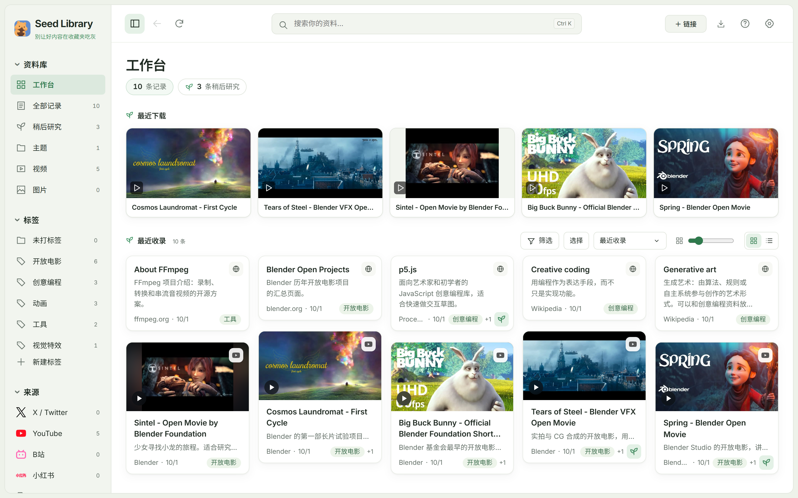
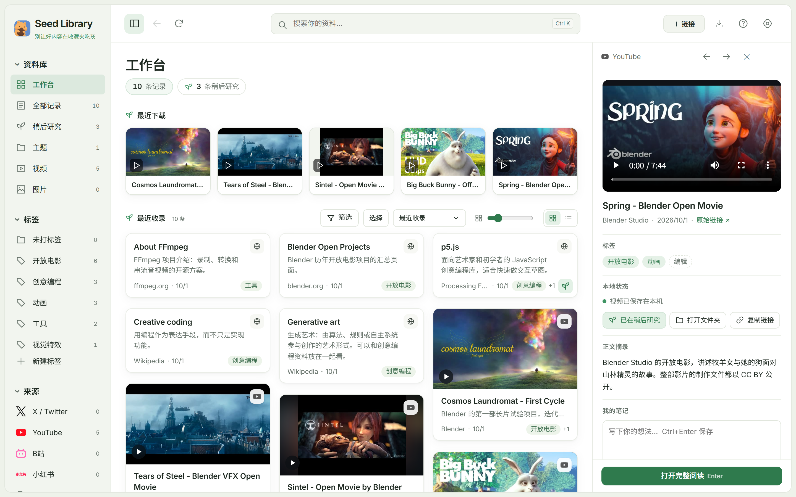
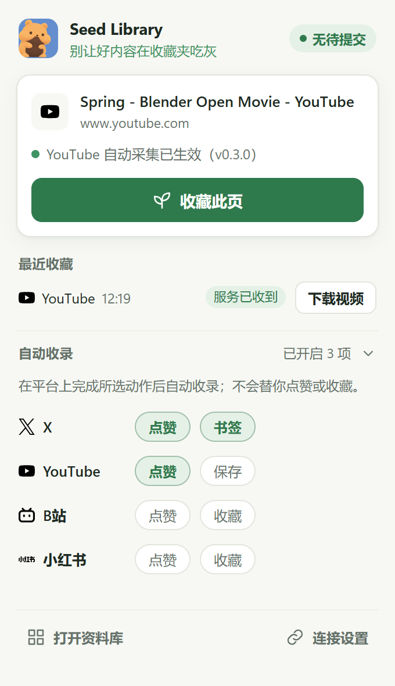
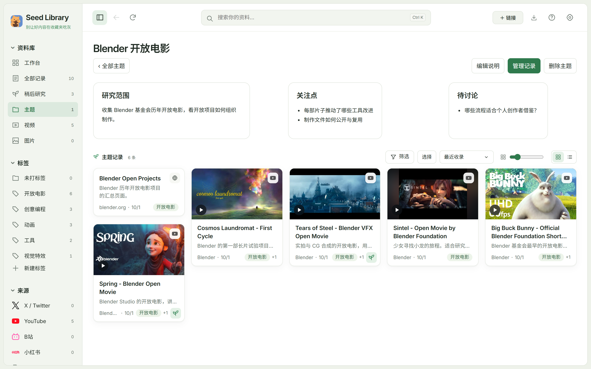

<h1 align="center">Seed Library</h1>

自动存档你看到的好内容

  <a href="../../releases/latest"><b>下载最新测试版</b></a> ·
  <a href="docs/GUIDE.md">完整使用说明</a> ·
  <a href="../../issues">反馈问题</a>

Seed Library 是一个 Windows 本地收藏工具。在 X、YouTube、B站、小红书上点赞或收藏时，内容会自动收进你电脑上的资料库；可以打标签、分主题、写笔记，并把视频下载到本地离线看。**所有资料都只保存在你自己的电脑上。**

<table><tr>
<td width="62%"></td>
<td></td>
</tr><tr>
<td align="center">预览面板：播放本地视频、改标签、写笔记</td>
<td align="center">浏览器插件</td>
</tr></table>

## 功能

- **自动收录**：在 X、YouTube、B站、小红书照常点赞 / 收藏即可；任意网页也能一键收藏。客户端没开时先暂存，打开后自动补交。
- **下载到本地**：单条或批量下载视频，下载前估算体积和磁盘空间。
- **整理**：标签、主题（把一组资料放在一起写研究说明）、“稍后研究”、笔记。
- **浏览**：瀑布流卡片、悬停预览本地视频、右侧预览面板、键盘操作。

## 开始使用

1. 从 [Releases](../../releases/latest) 下载 `Seed-Library-<版本>-Setup.exe` 并安装。
   测试版没有代码签名，Windows 提示“已保护你的电脑”时点 **更多信息 → 仍要运行**。
2. 首次启动选择资料目录（收藏、笔记、视频都存在这里）。
3. 安装浏览器插件：Chrome 打开 `chrome://extensions` → 打开“开发者模式” → “加载已解压的扩展程序” → 选择 `程序目录\app\browser-extension`。
4. 在客户端右上角 **?** 复制连接码，粘贴到插件的“连接设置”。
5. 去点赞或收藏第一条内容吧。

客户端右上角的 **?** 是使用指南和快捷键。更详细的安装、更新、卸载与常见问题见 [完整使用说明](docs/GUIDE.md)。

> 💡 遇到问题时，可以把 [完整使用说明](docs/GUIDE.md) 发给你的 AI 助手，让它一步步带你操作。

**系统要求**：Windows 10 / 11（64 位），Microsoft Edge WebView2 Runtime（Windows 11 自带），Chrome 或 Edge 浏览器。

## 技术

- 桌面外壳：[Tauri 2](https://tauri.app/)
- 本地服务：Node.js（内置 SQLite），界面为原生 HTML / CSS / JavaScript，组件使用 [Web Awesome](https://webawesome.com/)
- 浏览器插件：Chrome Manifest V3
- 下载：[yt-dlp](https://github.com/yt-dlp/yt-dlp) 与 [FFmpeg](https://ffmpeg.org/)；B站下载请求参数参考了 [小耳 VideoLab](docs/licenses.md)（MIT）
- 平台图标：[Simple Icons](https://simpleicons.org/)（CC0）

第三方组件的许可证随安装包附带在 `程序目录\app\licenses`，说明见 [docs/licenses.md](docs/licenses.md)。

## 说明

截图使用演示资料库：视频封面来自 Blender Foundation / Blender Studio 的开放电影（Spring、Big Buck Bunny、Sintel、Tears of Steel、Cosmos Laundromat，CC BY 授权，© Blender Foundation，[blender.org](https://www.blender.org/about/projects/)）。

本仓库用于发布 Seed Library 的安装包和使用说明，源代码暂未公开。目前是测试版，欢迎在 [Issues](../../issues) 反馈问题和建议。请只收藏和下载你有权保存的内容，并遵守各平台的使用条款。
